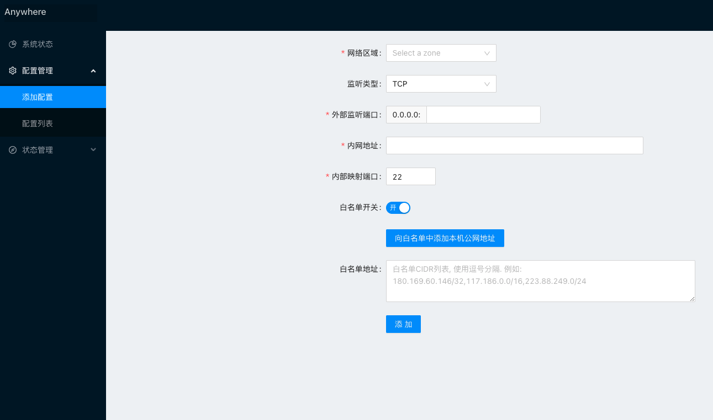
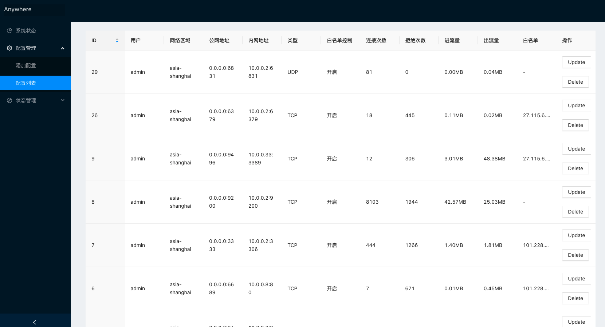
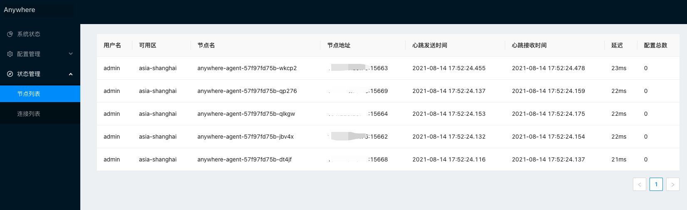
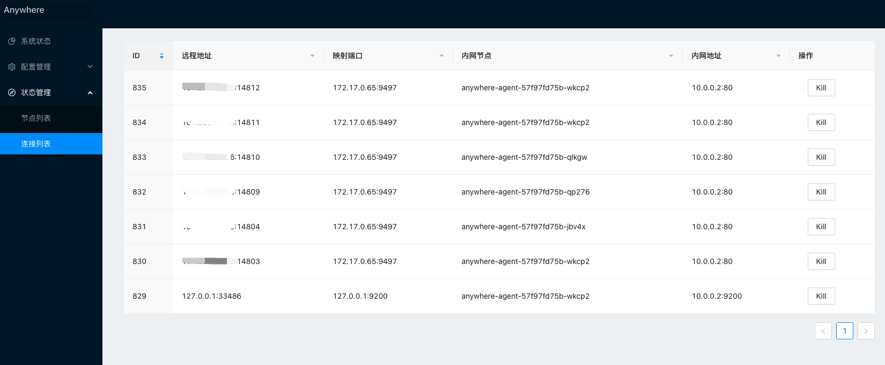
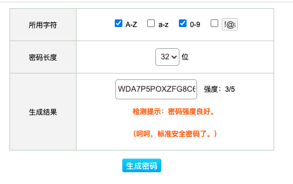

## Anywhere

- [Anywhere](#anywhere)

  - [是什么](#是什么)
  - [特性](#特性)
    - [功能特性](#功能特性)
    - [安全特性](#安全特性)
  - [基础概念](#基础概念)
    - [Agent 端](#agent-端)
    - [可用区](#可用区)
    - [Server 端](#server-端)
  - [功能截图](#功能截图)
  - [安装](#安装)

### 是什么

Anywhere 是一个内网穿透工具, 类似 [ngrok](https://github.com/inconshreveable/ngrok).  
 相比 Ngrok, Anywhere 增强了可视化管理和高可用功能, 使得使用者可以和方便的对内网穿透进行配置.

### 特性

#### 功能特性

- TCP/UDP 穿透.
- 全功能的图形化配置管理页面, 添加/删除穿透配置, 节点状态查看, 穿透连接管理.
- 多可用区高可用, 同一可用区内网中可以同时运行多个 Agent, 单个 Agent 崩溃后不影响功能使用.
- 流量统计等其他功能

#### 安全特性

- 动态密码+HTTPS 方式登陆管理页面
- Server/Agent 使用 TLS 认证
- 穿透支持 IP 白名单,不在白名单不允许连接.

### 基础概念

#### Agent 端

内网环境中的机器,通常是位于家中/公司中等没有公网 IP 的环境.  
Agent 端运行的程序与 Server 端程序维持长连接(管理连接, 用于 Server 端下发穿透指令)

#### 可用区

网络区域的抽象概念,比如: 家中/公司. 每个可用区必须运行至少一个 Agent 才能提供到此可用区的穿透功能.

#### Server 端

公网 IP 机器(虚拟机),提供广域网的入口.
添加一个新的穿透配置时, 您需要选择 Server 端口+可用区+内网地址, 添加完成后, 所有流入 Server 此端口的流量都会转发到指定可用区的指定地址.

### 功能截图









### 安装

请移步[Actions](https://github.com/cntechpower/v2ray-webui/actions?query=workflow%3ABuild+branch%3Amain) , 从 Artifacts 中下载最新版本安装包
下载完成后, 首先将安装包上传到 Agent 端机器,重新生成一下 SSL 证书(Server/Agent 通信使用 SSL 证书验证, 请务必不要使用安装包内的默认证书)

#### Agent 安装,并重新生成证书

```shell script
### Agent端执行如下命令
mkdir /usr/local/anywhere
tar -xvf anywhere-master.tar.gz -C /usr/local/anywhere
cd /usr/local/anywhere
make newkey
#打包Server端程序
tar -czvf anywhere-server.tar.gz bin/anywhered credential/ static/ anywhered.json
```

#### Server 安装,并启动

将`anywhere-server.tar.gz`上传到 Server 端机器

```shell script
### Server端执行如下命令
mkdir /usr/local/anywhere
tar -xvf anywhere-server.tar.gz -C /usr/local/anywhere
cd /usr/local/anywhere
```

修改`anywhered.json`中的默认用户配置:
将 otp_enable 改为 true, 用户名和密码自行设置.

勾选大写字母和数字,长度 32 位,重新生成动态密码口令,并使用新密码修改 otp_code



[密码生成工具](https://suijimimashengcheng.bmcx.com/)

```
                "user_name": "admin",
                "user_password": "admin",
                "otp_enable": true,
                "otp_code": "ZKQVBFY55NJGGWBV5F6CU5CEK2YAWIB6"
```

启动 Anywhere

```shell script
nohup ./bin/anywhered start > anywhered.log 2>&1 &
```

#### 启动 Agent

```shell script
### Agent端执行如下命令
cd /usr/local/anywhere
# $HOSTNAME替换为节点名, 每个Agent不能重复
# $SERVER_ADDR替换为Server端的公网IP地址
# $USER_NAME替换为anywhered.json中的user_name
# $PASSWORD替换为anywhered.json中的user_password
# $ZONE_NAME为可用区名,可自定义. 如: asia-shanghai
nohup ./bin/anywhere -i $HOSTNAME -s $SERVER_ADDR -u $USER_NAME -z $ZONE_NAME  --pass $PASSWORD > anywhere.log 2>&1 &
```

#### 访问管理页面

##### 手机安装动态密码管理器

安装 Authy 或其他工具, [下载地址](https://apkpure.com/twilio-authy-2-factor-authentication/com.authy.authy)
导入动态密码: Add account->Enter Code Manually->输入`anywhered.json`中的 otp_code

##### 访问页面

访问`https://$SERVER_IP:1114`
PS: 需要导入自签发证书,可参照如下文档(文档不保证实时性和正确性,如有异常请自行搜索其他文档)
[Windows 导入证书](https://cnzhx.net/blog/self-signed-certificate-as-trusted-root-ca-in-windows/)
[macOS 导入证书](https://support.apple.com/zh-cn/guide/keychain-access/kyca2431/mac)

输入用户名/密码/动态码进行登录
